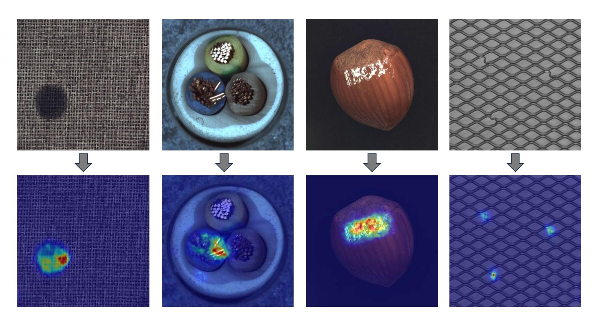

# Fork Project
This project Fork from [https://github.com/gdwang08/STFPM.git]，original author: [gdwang08]
pytorch implementation for the paper entitled "Student-Teacher Feature Pyramid Matching for Anomaly Detection" (BMVC 2021)
https://arxiv.org/abs/2103.04257v3


# statement
This project modifies the STFPM project released by the original author, fixing the problem that the original project code could not generate and save abnormal heatmap segmentation. This project modifies the main.py file to support saving the abnormal segmentation result during project execution. At the same time, detailed Chinese comments have been added to the main.py code to facilitate readers' understanding.  

本项目修改了原作者发布的STFPM项目，修复了原项目代码无法生成和保存异常热图分割的问题，主要修改了main.py文件，以支持保存项目执行过程中的异常分割结果。同时，main.py代码中添加了详细的中文注释，以方便读者理解。

# Dataset
Download dataset from [MvTec website](https://www.mvtec.com/company/research/datasets/mvtec-ad/).

# Training
Train a model:
```
python main.py train --mvtec-ad mvtec_anomaly_detection --category carpet --epochs 200
```
After running this command, a directory `snapshots/carpet` should be created.  
运行此命令后，会生成一个目录‘ snapshot /carpet ’。

# Testing
## Evaluate a model:
```
python main.py test --mvtec-ad your_MvTec-AD_dataset_path --category carpet --checkpoint snapshots/carpet/best.pth.tar
```
This command will evaluate the model specified by --checkpoint argument.  
这个命令会计算由“checkpoint”参数指定的模型。

## Save the abnormal segmentation results:
```
python main.py test --mvtec-ad your_MvTec-AD_dataset_path --category carpet --checkpoint snapshots/carpet/best.pth.tar --save-fig --result-path './results/'
```
This command will save the anomaly segmentation results (heatmap) to the file path you specify  
这个命令会保存异常分割结果（热力图）到你指定的文件路径下

You may download the pre-trained models [here](https://drive.google.com/drive/folders/16Ra76UhwY8EZg2SAaJCdFFZfaJbpGhdq?usp=sharing).

For per-region-overlap (PRO) calculation, you may refer to [here](https://github.com/YoungGod/DFR/blob/a942f344570db91bc7feefc6da31825cf15ba3f9/DFR-source/anoseg_dfr.py#L447). Note that it might take a long time for PRO calculation.

# Segmentation results


# Results

You are expected to obtain the same numbers given the pre-trained models.

|  Category    |   AUC-ROC(pixel)  |   AUC-ROC (image)  | PRO |
| :---------:  |  :-----: |  :-----: |  :-----: |
| carpet       | 0.990292 | 0.964286 | 0.966061 |
| grid         | 0.989622 | 0.982456 | 0.963767 |
| leather      | 0.990707 | 0.950747 | 0.956661 |
| tile         | 0.969067 | 0.982323 | 0.896640 |
| wood         | 0.964588 | 0.996491 | 0.900518 |
| bottle       | 0.987894 | 1.000000 | 0.959157 |
| cable        | 0.957504 | 0.935532 | 0.894954 |
| capsule      | 0.985730 | 0.893498 | 0.895790 |
| hazelnut     | 0.984715 | 1.000000 | 0.952182 |
| meta_nut     | 0.971789 | 0.983382 | 0.948197 |
| pill         | 0.975505 | 0.951173 | 0.965973 |
| screw        | 0.988481 | 0.894651 | 0.948661 |
| toothbrush   | 0.989551 | 0.897222 | 0.926844 |
| transistor   | 0.819404 | 0.939167 | 0.880923 |
| zipper       | 0.987756 | 0.961397 | 0.868873 |
| <b>average</b>      | <b>0.970174</b> | <b>0.955488</b> | <b>0.9283467</b> |


# Citation

If you find the work useful in your research, please cite our papar.
```
@inproceedings{wang2021student_teacher,
    title={Student-Teacher Feature Pyramid Matching for Anomaly Detection},
    author={Wang, Guodong and Han, Shumin and Ding, Errui and Huang, Di},
    booktitle={The British Machine Vision Conference (BMVC)},
    year={2021}
}
```
